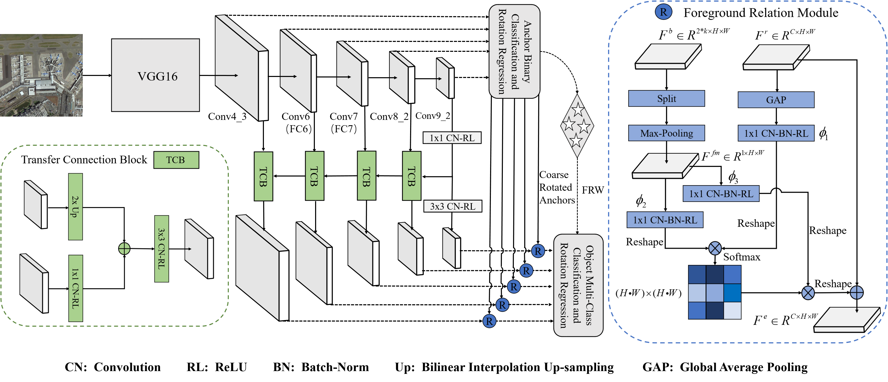

This is the code for "Foreground Refinement Network for Rotated Object Detection in Remote Sensing Images"

## Introduction
This codebase is created to build benchmarks for object detection in aerial images.
It is modified from [AerialDetection](https://github.com/dingjiansw101/AerialDetection).
The master branch works with **PyTorch 1.1** or higher. If you would like to use PyTorch 0.4.1,
please checkout to the [pytorch-0.4.1](https://github.com/open-mmlab/mmdetection/tree/pytorch-0.4.1) branch.

## Installation

  Please refer to [INSTALL.md](INSTALL.md) for installation.

    
## Get Started

Please see [GETTING_STARTED.md](GETTING_STARTED.md) for the basic usage of mmdetection.

## Contributing

We appreciate all contributions to improve benchmarks for object detection in aerial images. 

## Thanks to the Third Party Libs

[Pytorch](https://pytorch.org/)

[mmdetection](https://github.com/open-mmlab/mmdetection)

[AerialDetection](https://github.com/dingjiansw101/AerialDetection)